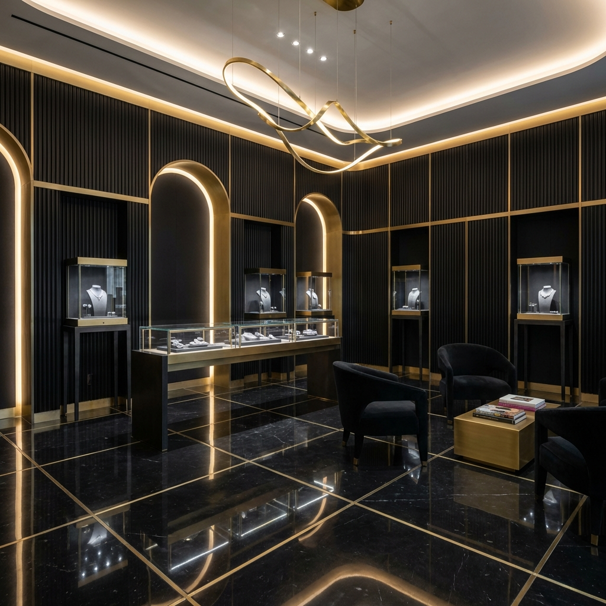

# AZURÉIQ

**Ignite Your Legacy.**

AZURÉIQ is a digital-first high jewelry atelier, merging the rarity of bespoke heirlooms with the precision of artificial intelligence.



## 💎 The Experience

Beyond a traditional e-commerce platform, AZURÉIQ offers an immersive digital sanctuary where clients can explore, customize, and acquire pieces of unparalleled craftsmanship.

### Key Features

*   **Aura (AI Concierge)**: A sophisticated, voice-enabled AI assistant that guides clients through collections, answers inquiries with brand-aligned poise, and schedules private viewings. Powered by VAPI and ElevenLabs.
*   **Hyper-Realistic 3D Visualization**: Interactive, high-fidelity 3D product showcases that allow clients to inspect every facet of our creations.
*   **Scrollytelling Narratives**: Cinematic web design that weaves the story of each collection through motion and visual depth.
*   **Exclusive Access Tiers**: A gated ecosystem for Collectors, Connoisseurs, and Legacy members.

## 🛠️ Technology Stack

Built with a focus on performance, aesthetics, and seamless interaction.

*   **Framework**: [Next.js 14](https://nextjs.org/) (App Router, TypeScript)
*   **Styling**: [Tailwind CSS](https://tailwindcss.com/) & [Framer Motion](https://www.framer.com/motion/)
*   **Voice AI**: [VAPI](https://vapi.ai/) (Voice AI Pipeline) + [ElevenLabs](https://elevenlabs.io/) (Synthesis)
*   **3D Engine**: [Three.js](https://threejs.org/) / [React Three Fiber](https://docs.pmnd.rs/react-three-fiber)
*   **Deployment**: [Netlify](https://www.netlify.com/) (Static Export)

## 🚀 Getting Started

### Prerequisites

*   Node.js 18+
*   npm or yarn

### Installation

1.  Clone the repository:
    ```bash
    git clone https://github.com/dhruvtalnewar01/Azureiq.git
    cd Azureiq
    ```

2.  Install dependencies:
    ```bash
    npm install
    ```

3.  Set up environment variables:
    Create a `.env.local` file and add your VAPI keys:
    ```env
    NEXT_PUBLIC_VAPI_PUBLIC_KEY=your_public_key
    NEXT_PUBLIC_VAPI_ASSISTANT_ID=your_assistant_id
    ```

4.  Run the development server:
    ```bash
    npm run dev
    ```

    Open [http://localhost:3000](http://localhost:3000) to view the atelier.

## 📦 Deployment (Netlify)

This project is configured for static export.

1.  Build the project:
    ```bash
    npm run build
    ```
    This generates an `out` folder.

2.  Deploy the `out` folder to Netlify or any static hosting provider.
    *   **Netlify Note**: Add your environment variables in the Netlify dashboard under "Site settings" > "Build & deploy" > "Environment".

## 🔒 Privacy & Exclusivity

AZURÉIQ values the total privacy of all patrons. Physical locations and legacy services are disclosed upon confirmed booking.

---

© 2026 AZURÉIQ. All Rights Reserved.
